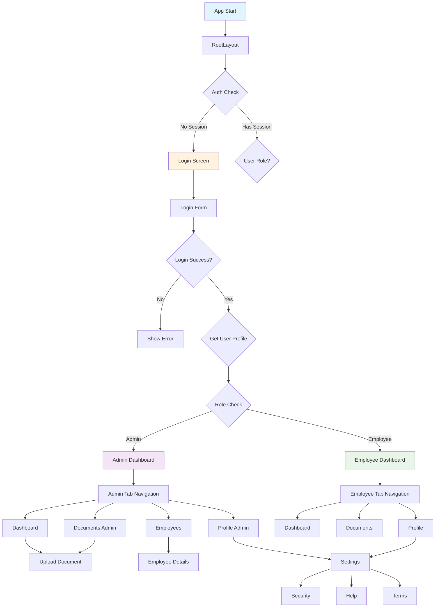

# Navigation Flow - Employee Management App

## 🧭 Navigation Architecture Overview

The app uses **Expo Router** with **file-based routing** combined with **role-based access control**. Navigation flows are determined by user authentication status and role (Admin vs Employee).

## 🔄 Complete Navigation Flow Diagram



## 🚪 Authentication Flow

### **Initial App Load**
```
1. App starts → RootLayout renders
2. useAuth hook initializes → Checks Supabase session
3. Loading state shown while checking auth
4. If no session → Redirect to /login
5. If session exists → Check user profile role
6. Redirect based on role:
   - Admin → /(admin-tabs)/dashboard
   - Employee → /(tabs)/dashboard
```

### **Login Process**
```
LoginScreen
├── User enters credentials
├── AuthService.login() called
├── Supabase authenticates
├── Success → Get user profile
├── Redirect based on role
└── Error → Show error message
```

### **Logout Process**
```
Any Screen
├── User triggers logout
├── AuthService.logout() called
├── Supabase session cleared
├── useAuth state reset
└── Redirect to /login
```

## 🛡️ AuthGuard Protection System

### **How AuthGuard Works**
```typescript
// AuthGuard wraps protected routes
<AuthGuard requiredRole="admin">
  <AdminDashboard />
</AuthGuard>

// Internal logic:
1. Check if user is authenticated
2. If not → Redirect to /login
3. If authenticated → Check required role
4. If role mismatch → Redirect to appropriate dashboard
5. If role matches → Render children
```

### **Protected Route Categories**

#### **Admin-Only Routes**
- `/(admin-tabs)/dashboard` - Admin dashboard
- `/(admin-tabs)/documents-admin` - Document administration
- `/(admin-tabs)/employees` - Employee management
- `/(admin-tabs)/employee-details/[id]` - Employee details
- `/(admin-tabs)/profile` - Admin profile

#### **Employee-Only Routes**
- `/(tabs)/dashboard` - Employee dashboard
- `/(tabs)/documents` - Personal documents
- `/(tabs)/profile` - Employee profile

#### **Shared Routes**
- `/documents/upload` - Document upload (both roles)
- `/settings` - Settings (both roles)
- `/security` - Security settings (both roles)
- `/help` - Help & support (both roles)
- `/terms` - Terms & privacy (both roles)

## 📱 Tab Navigation Systems

### **Employee Tab Navigation** `(tabs)`
```
┌─────────────────────────────────┐
│  🏠 Dashboard  📄 Documents  👤 Profile  │
└─────────────────────────────────┘
```

**Routes:**
- `/(tabs)/dashboard` - Employee dashboard with personal stats
- `/(tabs)/documents` - Personal document management
- `/(tabs)/profile` - Employee profile settings

### **Admin Tab Navigation** `(admin-tabs)`
```
┌─────────────────────────────────────────────────┐
│  🏠 Dashboard  📁 Docs  👥 Employees  👤 Profile  │
└─────────────────────────────────────────────────┘
```

**Routes:**
- `/(admin-tabs)/dashboard` - Admin dashboard with system stats
- `/(admin-tabs)/documents-admin` - All documents management
- `/(admin-tabs)/employees` - Employee management
- `/(admin-tabs)/profile` - Admin profile settings

## 🔄 Navigation State Management

### **Auth State Flow**
```typescript
useAuth Hook
├── State: { user, profile, loading, error }
├── Actions: { login, logout, clearError }
├── Computed: { isAuthenticated, isAdmin, isEmployee }
└── Effects: Session monitoring, cleanup
```

### **Navigation Triggers**

#### **Automatic Navigation**
1. **Auth state changes** → Role-based redirects
2. **Role mismatch** → Redirect to appropriate dashboard
3. **Session expiry** → Redirect to login

#### **User-Initiated Navigation**
1. **Tab presses** → Switch between tabs
2. **Button presses** → Navigate to specific screens
3. **Link presses** → Navigate to shared screens

## 🎯 Detailed Navigation Scenarios

### **Scenario 1: Admin Login**
```
1. Admin opens app → No session
2. Redirected to /login
3. Enters admin credentials
4. Login successful → Profile loaded (role: admin)
5. Redirected to /(admin-tabs)/dashboard
6. Can access all admin tabs and shared screens
7. Cannot access employee-specific tabs
```

### **Scenario 2: Employee Login**
```
1. Employee opens app → No session
2. Redirected to /login
3. Enters employee credentials
4. Login successful → Profile loaded (role: employee)
5. Redirected to /(tabs)/dashboard
6. Can access all employee tabs and shared screens
7. Cannot access admin-specific tabs
```

### **Scenario 3: Role-Based Access Attempt**
```
1. Employee tries to access admin route directly
2. AuthGuard intercepts request
3. Checks user role (employee)
4. Required role: admin → Mismatch
5. Redirected to /(tabs)/dashboard
6. Shows loading state during redirect
```

### **Scenario 4: Session Expiry**
```
1. User is active in app
2. Supabase session expires
3. useAuth detects session change
4. AuthState updated: user: null, profile: null
5. AuthGuard redirects to /login
6. User must login again
```

## 🔗 Deep Linking & URL Structure

### **URL Patterns**
```
Public Routes:
/                    # Landing page
/login               # Login screen

Employee Routes:
/(tabs)/dashboard    # Employee dashboard
/(tabs)/documents    # Employee documents
/(tabs)/profile      # Employee profile

Admin Routes:
/(admin-tabs)/dashboard       # Admin dashboard
/(admin-tabs)/documents-admin # Admin documents
/(admin-tabs)/employees       # Employee management
/(admin-tabs)/profile         # Admin profile

Shared Routes:
/documents/upload    # Document upload
/settings            # Settings
/security            # Security
/help                # Help
/terms               # Terms
/reports             # Reports
```

### **Route Group Benefits**
- Parentheses `(tabs)` and `(admin-tabs)` create logical groups
- Don't affect URL structure (clean URLs)
- Enable separate tab layouts
- Allow role-based navigation isolation

## 🎨 Navigation UI Components

### **Tab Bar Customization**
```typescript
// Employee Tab Bar
Tab.Navigator
├── Dashboard Icon + Label
├── Documents Icon + Label
└── Profile Icon + Label

// Admin Tab Bar
Tab.Navigator
├── Dashboard Icon + Label
├── Documents Icon + Label
├── Employees Icon + Label
└── Profile Icon + Label
```

### **Header Configuration**
```typescript
// Stack Screen Options
<Stack.Screen 
  name="documents/upload" 
  options={{ 
    title: 'Upload Document',
    headerShown: true 
  }} 
/>
```

## ⚡ Performance Optimizations

### **Navigation Performance**
1. **Lazy Loading**: Screens load only when accessed
2. **Route Preloading**: Critical routes preloaded
3. **State Persistence**: Auth state maintained across navigation
4. **Optimized Re-renders**: useCallback and useMemo in hooks

### **Memory Management**
```typescript
// Cleanup in hooks
useEffect(() => {
  return () => {
    isMounted.current = false;
    AuthService.cleanup();
  };
}, []);
```

## 🐛 Common Navigation Issues & Solutions

### **Issue 1: Auth Redirect Loops**
**Problem**: Continuous redirects between login and dashboard
**Solution**: Proper loading state management in AuthGuard

### **Issue 2: Role-Based Access Not Working**
**Problem**: Users accessing wrong role routes
**Solution**: Ensure AuthGuard wraps all protected routes

### **Issue 3: Session Not Persisting**
**Problem**: Users logged out on app restart
**Solution**: Proper Supabase session persistence configuration

### **Issue 4: Tab Navigation Not Updating**
**Problem**: Tab bar not reflecting current route
**Solution**: Proper route configuration and state management

## 🔄 Navigation Testing Scenarios

### **Test Cases**
1. **Unauthenticated user** → Should only access login
2. **Employee user** → Should access employee tabs only
3. **Admin user** → Should access admin tabs only
4. **Session expiry** → Should redirect to login
5. **Direct URL access** → Should respect role permissions
6. **Tab switching** → Should maintain auth state
7. **Logout** → Should clear session and redirect

This navigation system provides a robust, secure, and user-friendly way to navigate through the Employee Management app while maintaining proper access control and security boundaries.
