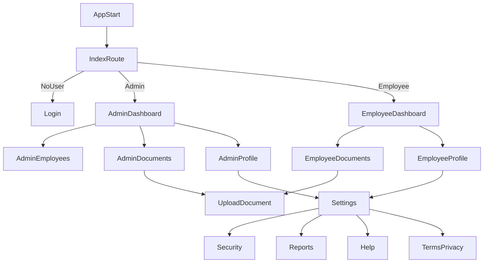

# Navigation Flow

This app uses Expo Router with role-based tab groups and shared utility screens.

```mermaid
flowchart TD
  launch[AppStart] --> index[IndexRoute]
  index -->|NoUser| login[Login]
  index -->|Admin| adminDash[AdminDashboard]
  index -->|Employee| employeeDash[EmployeeDashboard]

  employeeDash --> employeeDocs[EmployeeDocuments]
  employeeDash --> employeeProfile[EmployeeProfile]
  employeeDocs --> uploadDoc[UploadDocument]

  adminDash --> adminEmployees[AdminEmployees]
  adminDash --> adminDocs[AdminDocuments]
  adminDash --> adminProfile[AdminProfile]
  adminDocs --> uploadDoc

  employeeProfile --> settings[Settings]
  adminProfile --> settings
  settings --> security[Security]
  settings --> reports[Reports]
  settings --> help[Help]
  settings --> terms[TermsPrivacy]
```
