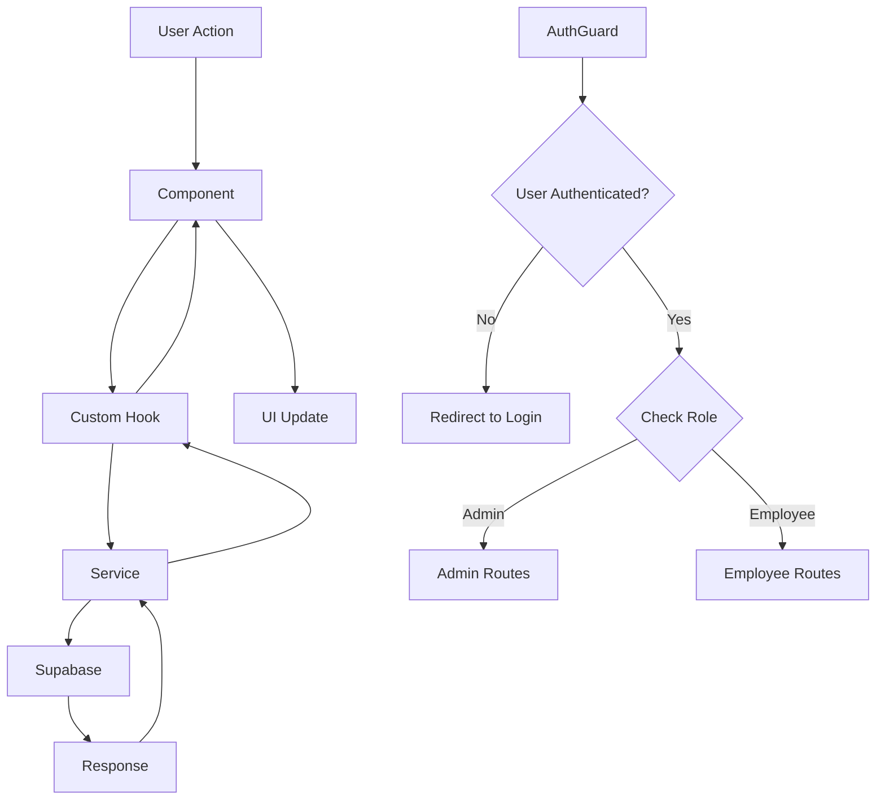

# Employee Management App - Project Structure

## 📁 Directory Structure

```
EmployeeManagement/
├── 📱 app/                          # Expo Router screens (file-based routing)
│   ├── 📄 _layout.tsx              # Root layout with PaperProvider & auth loading
│   ├── 📄 index.tsx                # Landing page
│   ├── 📄 login/                   # Authentication screens
│   ├── 📄 documents/               # Document-related screens
│   │   └── 📄 upload.tsx          # Document upload screen
│   ├── 📄 help.tsx                # Help & support
│   ├── 📄 reports.tsx             # Reports
│   ├── 📄 settings.tsx            # Settings
│   ├── 📄 security.tsx            # Security settings
│   ├── 📄 terms.tsx               # Terms & privacy
│   ├── 📂 (tabs)/                 # Employee routes (tab navigation)
│   │   ├── 📄 _layout.tsx         # Employee tab layout
│   │   ├── 📄 dashboard.tsx       # Employee dashboard
│   │   ├── 📄 documents.tsx       # Employee document management
│   │   └── 📄 profile.tsx         # Employee profile
│   └── 📂 (admin-tabs)/           # Admin routes (tab navigation)
│       ├── 📄 _layout.tsx         # Admin tab layout
│       ├── 📄 dashboard.tsx       # Admin dashboard
│       ├── 📄 documents-admin.tsx # Admin document management
│       ├── 📄 employees.tsx       # Employee management
│       ├── 📄 employee-details.tsx # Employee details
│       └── 📄 profile.tsx         # Admin profile
├── 🎨 assets/                      # Static assets (icons, images)
├── 📚 docs/                        # Documentation
├── 🔧 src/                         # Source code
│   ├── 🧩 components/              # Reusable UI components
│   │   └── 📄 AuthGuard.tsx       # Role-based access control wrapper
│   ├── 🪝 hooks/                   # Custom React hooks
│   │   ├── 📄 useAuth.ts          # Authentication state management
│   │   └── 📄 useDocuments.ts     # Document operations hook
│   ├── 🖥️ screens/                 # Standalone screens
│   │   └── 📄 LoginScreen.tsx     # Login screen component
│   ├── 🌐 services/                # Business logic & API calls
│   │   ├── 📄 AuthService.ts      # Authentication service
│   │   ├── 📄 EmployeeService.ts  # Employee CRUD operations
│   │   ├── 📄 documentService.ts  # Document management service
│   │   └── 📂 supabase/           # Supabase configuration
│   │       └── 📄 supabaseClient.ts # Supabase client setup
│   ├── 📋 types/                   # TypeScript type definitions
│   │   ├── 📄 auth.ts             # Authentication types
│   │   └── 📄 document.ts         # Document types
│   ├── 🎨 theme/                   # App theming (empty currently)
│   └── 🛠️ utils/                   # Utility functions (empty currently)
├── 📄 package.json                 # Dependencies & scripts
├── 📄 tsconfig.json               # TypeScript configuration
├── 📄 babel.config.js             # Babel configuration
├── 📄 metro.config.js             # Metro bundler config
├── 📄 app.json                    # Expo configuration
└── 📄 .gitignore                  # Git ignore rules
```

## 🏗️ Architecture Overview

### **Technology Stack**
- **Frontend**: React Native with Expo Router
- **Backend**: Supabase (Authentication + Database + Storage)
- **UI Library**: React Native Paper
- **Language**: TypeScript
- **State Management**: React Hooks (useState, useEffect, useContext)

### **Design Patterns**

#### **1. File-Based Routing**
- Uses Expo Router for navigation
- Routes automatically generated from file structure
- Parentheses `(tabs)` and `(admin-tabs)` create route groups without affecting URL

#### **2. Role-Based Access Control**
- `AuthGuard` component wraps protected routes
- Redirects users based on their role (admin/employee)
- Centralized authentication logic in `useAuth` hook

#### **3. Service Layer Architecture**
- Separation of concerns between UI and business logic
- Services handle API calls and data transformations
- Hooks manage state and component interactions

#### **4. Custom Hooks Pattern**
- `useAuth`: Global authentication state
- `useDocuments`: Document CRUD operations
- Encapsulates complex logic and provides clean API to components

## 🔄 Data Flow Diagram



## 📊 Component Hierarchy

### **Authentication Flow**
```
RootLayout
├── AuthGuard (wraps protected routes)
│   ├── useAuth Hook
│   │   ├── AuthService
│   │   └── Supabase Client
│   └── Role-based Redirect Logic
└── PaperProvider (UI Theme)
```

### **Document Management Flow**
```
Document Components
├── useDocuments Hook
│   ├── DocumentService
│   │   ├── Upload to Supabase Storage
│   │   ├── CRUD Operations
│   │   └── File Management
│   └── State Management
└── UI Components (Lists, Forms, etc.)
```

## 🔐 Security Architecture

### **Authentication Layers**
1. **Supabase Auth**: User authentication and session management
2. **AuthGuard Component**: Route-level protection
3. **Role-based Access**: Admin vs Employee permissions
4. **Service-level Validation**: Server-side checks in services

### **Data Protection**
- All API calls go through authenticated Supabase client
- Row Level Security (RLS) policies in Supabase
- Role-based data filtering in services

## 📱 Screen Categories

### **Public Screens**
- Landing Page (`index.tsx`)
- Login (`login/`)

### **Employee Screens** `(tabs)`
- Dashboard with employee-specific data
- Personal document management
- Profile management

### **Admin Screens** `(admin-tabs)`
- Admin dashboard with analytics
- Employee management (CRUD)
- Document administration
- System-wide reports

### **Shared Screens**
- Document upload (accessible from both roles)
- Settings, security, help, terms

## 🎯 Key Features Implementation

### **1. Document Management**
- File upload to Supabase Storage
- Metadata storage in database
- Role-based document access
- Download and delete functionality

### **2. User Management**
- Employee registration and profile management
- Admin oversight of all employees
- Role assignment and permissions

### **3. Navigation System**
- Tab-based navigation within roles
- Automatic role-based redirection
- Protected routes with AuthGuard

### **4. State Management**
- Centralized auth state
- Component-level state for UI
- Optimistic updates for better UX

## 🚀 Performance Considerations

### **Optimizations**
- Lazy loading of screens with Expo Router
- Efficient state updates with useCallback
- Memory leak prevention with cleanup functions
- Optimistic UI updates for better perceived performance

### **Best Practices**
- Custom hooks for reusable logic
- Service layer for API calls
- TypeScript for type safety
- Consistent error handling patterns

## 📝 Development Guidelines

### **Code Organization**
- Keep components focused and single-purpose
- Use custom hooks for shared logic
- Separate UI from business logic
- Maintain consistent naming conventions

### **File Naming**
- Screens: `PascalCase.tsx`
- Hooks: `camelCase.ts`
- Services: `PascalCase.ts`
- Types: `camelCase.ts`

This structure provides a scalable, maintainable foundation for the Employee Management application with clear separation of concerns and robust authentication/authorization systems.
